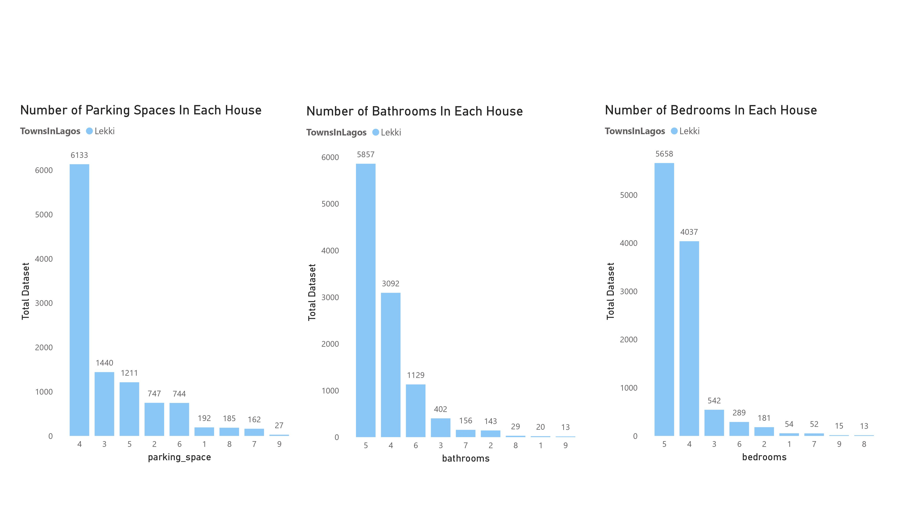

# NIGERIA-HOUSES-DATASET
NIGERIA HOUSES DATASET REPORT
## Project Outline
Comprehensive Analysis of Housing Data in Lagos State with a Focus on Lekki
## Table Of Content
1.0 - Introduction

2.0 - Data Source

3.0 - Tools Used

4.0 - Data Transformation

5.0 - Data Analysis and Visualizations

6.0 - Insights

7.0 - Conclusion/Recommendations

## 1.0 - Introduction
This report provides a comprehensive analysis of the housing data in Lagos State, focusing on various parameters such as the type of houses, the number of bedrooms, parking spaces, and bathrooms. The primary aim is to highlight Lekki as the central town for housing analysis within Lagos State.

 ## 2.0 - Data Sources
The Data Source was gotten from Kaggle [Download Here](https://www.kaggle.com/datasets/abdullahiyunus/nigeria-houses-and-prices-dataset)

## 3.0 - Tools Used
3.1 -**Microsoft Excel** [Download Here](www.microsoft.com)

3.2 -**Microsoft PowerBi** [Download Here](www.microsoft.com)

## 4.0 - Data Transformation

## 4.0 - Data Transformation

I downloaded the Nigeria House dataset from the website. I then used Microsoft excel to make sure that all of the data was correct and consistent. In order to preserve transparency, I carefully reviewed the data to confirm accuracy across all sources. I loaded the dataset into Power BI for visualization after completing the required cleaning and validation.

## 5.0 - Data Analysis and Visualization 
With the data loaded into Power BI, I conducted several analyses to uncover interesting metrics and key insights from the Nigeria House dataset. Using the visuals I created, I highlighted some of the crucial statistics related to the housing market. The analysis focused on various criteria such as house type, number of bedrooms, parking spaces, and bathrooms, providing a comprehensive overview of the housing trends in Lagos State.

*Lagos State Overview*
   - *Total Number of Houses*: Lagos State has the highest number of houses among 25 states, with a total of 18,445 houses.
   - *Dominant House Type*: The most prevalent house type in the total dataset is the Detached Duplex, with a total of 13,992 houses.

*Housing Characteristics in Lagos*
   - *Bedrooms*: The highest number of bedrooms found in houses in Lagos is 5.
   - *Parking Spaces*: The maximum number of parking spaces available in Lagos houses is 4.
   - *Bathrooms*: The highest number of bathrooms found in Lagos houses is 5.
   - *Dominant House Type*: The most prevalent house type in Lagos State is the Detached Duplex, with a total of 11,802 houses.

*Focus on Lekki*
   - *Total Houses in Lekki*: Lekki stands out as the town with the highest number of houses in Lagos, totaling 10,841 houses.
   - *Dominant House Type in Lekki*: Similar to the overall trend in Lagos, the predominant house type in Lekki is the Detached Duplex.
 

*Parking Spaces in Lekki*: The highest number of parking spaces in Lekki is 4.
*Bathrooms in Lekki*: The maximum number of bathrooms in Lekki houses is 5.
*Bedrooms in Lekki*: The highest number of bedrooms in Lekki houses is 5.

## 6.0 - Insights

1. **House Types in Lagos**
   
Lagos State boasts a variety of house types, with the Detached Duplex being the most common. This is indicative of the preferred residential style in the state. The distribution of house types is crucial for understanding the housing market and urban planning.

2. **Bedrooms, Parking Spaces, and Bathrooms**

Understanding the distribution of bedrooms, parking spaces, and bathrooms helps in assessing the living standards and preferences of residents in Lagos.

3. **Housing Analysis in Lekki**

Lekki emerges as the key area of focus due to its high number of houses and specific housing characteristics.

- *Total Houses*: Lekki has 10,841 houses, making it a significant part of the housing market in Lagos.
- *House Type*: Detached Duplexes dominate the housing landscape in Lekki.
- *Parking and Bathrooms*: Consistent with the state trend, the highest number of parking spaces and bathrooms in Lekki houses are 4 and 5, respectively.
- *Bedrooms*: The highest number of bedrooms in Lekki houses is 5

4. Types of Buildings in Lekki with Prices

The last two table above shows the different types of buildings in Lekki along with their respective prices and the bedroom, parking space and bathroom number.

## 7.0 - Conclusion/Recommendations

The data analysis clearly indicates that Lekki is the primary focus for housing in Lagos State. With the highest number of houses, particularly Detached Duplexes, and a notable number of bedrooms, parking spaces, and bathrooms, Lekki stands out as a key area for residential development and investment. Understanding these patterns helps in making informed decisions for urban planning, real estate investments, and housing policies in Lagos State.

 **Recommendations**

1. *Investment Opportunities*: Given the high number of Detached Duplexes, investors may find lucrative opportunities in developing similar or complementary housing projects in Lekki.
2. *Urban Planning*: Urban planners should focus on infrastructure development in Lekki to support the high residential density.
3. *Housing Policies*: Policymakers should consider the housing trends in Lekki to tailor housing policies that address the needs and preferences of the residents.

This comprehensive analysis underscores Lekki’s prominence in Lagos State's housing market and provides valuable insights for various stakeholders.

